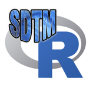
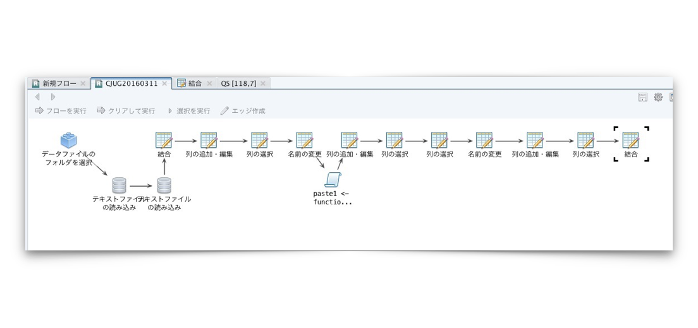
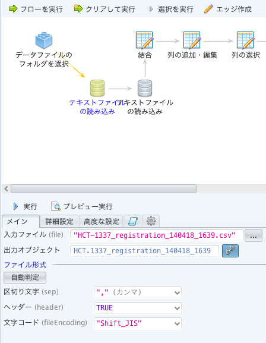
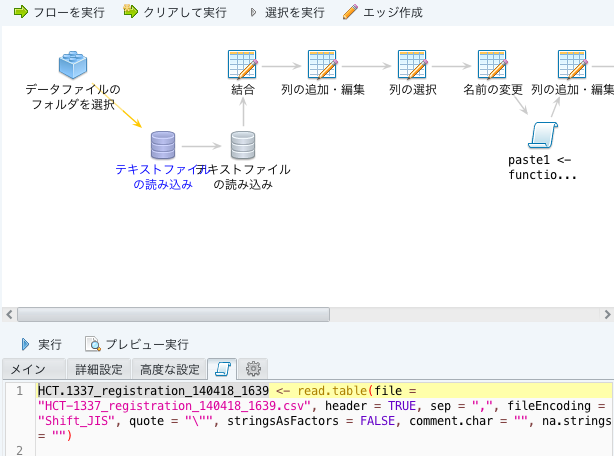
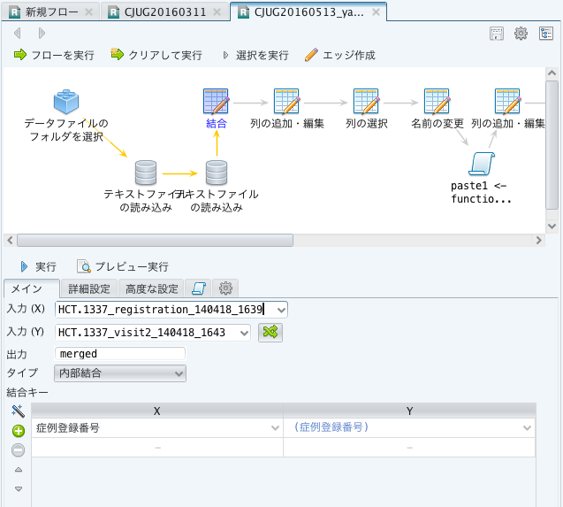
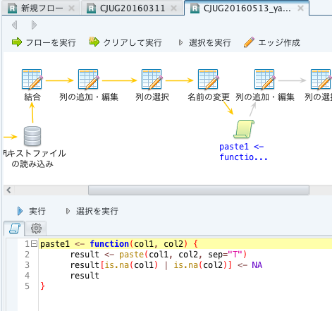
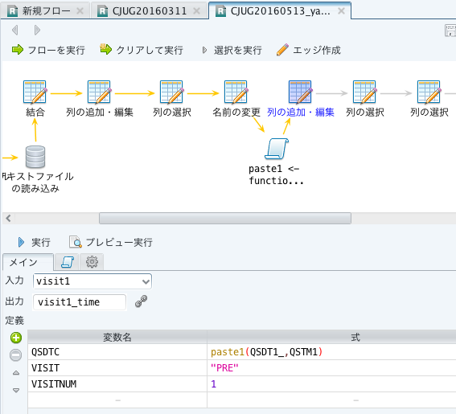

---
output:
  bookdown::pdf_document2: 
    latex_engine: lualatex
    toc: false
documentclass: ltjsarticle
---
<style>
body {
    overflow: scroll;
}
</style>

CJUG R+SDTM Team Activities
========================================================
author: CJUG SDTM team, R subteam
date: 2017/03/03
autosize: true

``


This presentaion can be found in following URL:

Presentation HTML file: http://rpubs.com/mokjpn/cjugws2017

Original R Markdown document: https://github.com/mokjpn/cjugr/blob/master/Workshop2017.Rpres

CJUG SDTM R subteam
========================================================

- Objective
  - Learn R language environment and related software.
  - Discuss how to make data managers’ work efficient with R.
- History
  - Start from Sep 2015.
  - Presentation at CJUG workshop 2016.
  - Activity Report on Jun 2016 meeting.
  - Presentation at CJUG workshop 2017. (This!)
- Members
  - Masafumi Okada, M.K, M.D, M.T, K.N, M.Y

Activities
========================================================

- By plain R
  - Import SDTM dataset to R's dataframe.
  - Draw some graphics, or make summary table from the imported dataframes.
- By R AnalyticFlow
  - Import raw dataset from comma-separated-value text file.
  - Merge some tables.
  - Calculate some derived values.
  - Compose SDTM-like table.
- By Rstudio and R markdown
  - Write simple data management report with R markdown format.
- By Rstudio and GitHub
  - Version control of R script.
  - Co-editing R markdown document

Import SDTM dataset to R's dataframe in XPT format.
=====================

XPT files can be read by `read.xport()` function of `foreign` package.

```{r}
setwd("~/CJUG/SDTM/20_Work_in_progress/23_HCT-1337")
library(foreign)
# read.xportでxptファイルを変数QSに、データフレームとして読み込み
QS <- read.xport("30_Summary/dataset/QS.xpt")
DA <- read.xport("30_Summary/dataset/DA.xpt")
str(QS)
```

Import SDTM dataset to R's dataframe in Dataset-XMLformat.
=====================

Dataset-XML files can be read by `read.dataset.xml()` function of `R4DSXML` package.

```{r}
setwd("../Define2Validate")
library(R4DSXML)
# read.dataset.xmlでDataset-XMLファイルを変数CMに、データフレームとして読み込み
CM <- read.dataset.xml("Odm_CM.xml", "Odm_Define.xml")
str(CM)
```

Draw some graphics
==============================

```{r}
library(tidyr)
library(dplyr)
QS %>%  
  # mutate()は列を加工して新たな列を追加します。QSSTRESCの数値への変換。
  mutate(qsstrescn = as.numeric(as.character(QSSTRESC))) %>% 
  # select()は特定の列だけを取り出します。USUBJIDとQSTESTCDとqsstrescn だけに。
  select(USUBJID, QSTESTCD, qsstrescn) %>% 
  # USUBJID でグループ化
  group_by(USUBJID) %>% 
  # spread() はNormalized formatを、１行１症例のフォーマットに変換します。
　# QSTESTCDの値をそれぞれ列にして、qsstrescnを値にします。
  spread(QSTESTCD,qsstrescn) %>% 
  # POSTQとPRESQの差をとって、diffという列に追加します。
  mutate(diff = POSTQ - PREQS) %>% 
  # DAドメインの表を結合
  inner_join(DA,by="USUBJID") %>%
  # DASCATごとにdiffの値を箱ひげ図にします
  plot(diff ~ DASCAT, data=.) 

```

R AnalyticFlow
==============================

- **R AnalyticFlow** by Ef-prime, Inc. is a data analysis software that utilizes the R environment for statistical computing.
- With this software, the procedure of data cleaning can be composed by connecting some of icons which contains a set of frequently used R commands.
- Once an experienced data manager prepares a set of commands, even operators who do not have any experience of R programming can just use power of R. 
- The software is licensed under GNU LGPL license. We can use the software free for any use.



Import dataset by R AnalyticFlow
===================================

- Each connected icon has a function. Parameters can be set by user.



- Each icon has corresponding R code.




Merge tables by R AnalyticFlow
================================

- Merge two tables 



Define custom function, Edit variable
================================

- If you have experiences of R programming, you can define new "icon" with your R code. 



- With calculations by R built-in functions or your custom functions, you can make a new variable.




Write reports in R Markdown format
====================================

- **R Markdown** is a simple text file format, but R code can be embedded in the file.
- With `knitr` R package or `Rstudio` development software, we can convert R Markdown documents into HTML, Word, PDF, or Presentation like this.
- When converting, the embedded R codes are interpreted, then the results of calculations are also embedded into the final document.
- Now, we do not need to make any 'temporary files'. Just write a R code to read the data from the original file, and codes to make tables and graphics inside the report. 
- By using R markdown, there is no more problems like: 
  - Original data changed, but the reports are not updated.
  - No one remembers how to read original data and update reports in detail.
  - Use filenames like 'Analysis_2017Feb22.RData' to control version of temporary analysis files.
  
Embedding R code in your report document
========================================

Like that:

<pre>
Dataset-XML files can be read by `read.dataset.xml()` function of `R4DSXML` package.

`r ''````{r}
setwd("../Define2Validate")
library(R4DSXML)
# read.dataset.xmlでDataset-XMLファイルを変数CMに、データフレームとして読み込み
CM <- read.dataset.xml("Odm_CM.xml", "Odm_Define.xml")
str(CM)
```
</pre>

The code inside backquotes are interpreted when converting document into HTML/Word/PDF, and the result(string representation of CM variable) will be displayed in the final document even there is no actual data in the R markdown document.

From the Rmd document below:
```{r, eval=FALSE}
Currently, there are `r length(unique(DM$USUBJID))` subjects. Number of non-treated arm is `r length(na.omit(DM$ACTARMCD=="NOTTRT"))`.
```
You will get this Word file:

```
Currently, there are 32 subjects. Number of non-treated arm is 8.
```

This technique will improve **reproducibility** of the document, because the actual data is not written in document. Every time we need the values, it will be re-calculated from the original dataset. This concept is known as 'Reproducible Research'. 


Version control of R script and R markdown document
====================================================

- All activities in R Team are stored in the GitHub repository. http://github.com/mokjpn/cjugr/
- Git is a version control system, mainly for text files. R source code, R markdown documents, or any XML documents can be well managed by git.
- Git focuses on collabolation of programmers. All members of a project can copy('clone') the current version, then make some changes, and merge('commit') the changes. If there is any conflict of changes, members can discuss which commit is acceptable. 
- All change logs are preserved, so we can back into any old revision at any time.
- GitHub is a web-based hosting service of Git Repository, with many original features that help collabolation.

Summary
=========================

- CJUG SDTM+R Team members have learnt R language environment and related software, and discussed how to make data managers’ work efficient with R.
- We recommend "R AnalyticFlow" tool as an efficient tool to compose everyday workflow with the power of R language.
- For the purpose of authoring data reports, we recommend using "R Markdown" format, to keep authoring work simple and improve reproducibility of documents.
- Also we recommend git version control system to manage revisions of R script source and R markdown document, that enables collabolation of statistical programmers and skillful data managers.

Question & Answers
=========================

- Q: To begin using R, which packages do you recommend?

- A: If you would like to code using some modern expressions like '%>%', I recommend to install 'tidyverse' package first. It includes much of modern features, such as ggplot2 graphics, dplyr data manipulation, readr data import. But if your textbook does not use these modern features, you do not need to install any package. Plain R itself contain all of basic, easy-to-learn methods to import, manipulate, and analyse your data.

- Q: What is superiority of R compareing to SAS? (excluding the price issue) 

- A: Unfortunately I have no experience of using SAS. So I cannot answer this question. But one thing I can say is that I have no problem when I handle SDTM dataset with R.

- Q: When I use R for my business, will the validation of R required?

- A: In general, the computer system validation will be required to produce dataset for the submission. To include R or Rstudio for your business process, these documents will be helpful:
  - [R: Regulatory Compliance and Validation Issues, A Guidance Document for the Use of R in Regulated Clinical Trial Environments](https://www.r-project.org/doc/R-FDA.pdf)
  - [RStudio: Regulatory Compliance and Validation Issues, A Guidance Document for the Use of RStudio Integrated Development Environment (IDE) Commercial Products in Regulated Clinical Trial Environments](https://www.rstudio.com/wp-content/uploads/2014/06/RStudio-Commercial-IDE-Validation.pdf)
  


